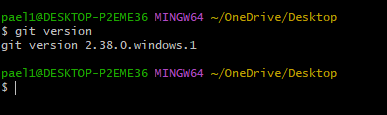

## raphel ajie pratama tanoyo
## TI.22.A3
## Install Git 
    
1. Download Git,buka website resminya Git ```git-scm.com```
    
2. Kemudian Unduh git sesuai dengan arsitektur komputer anda kalau menggunakan 64 bit, unduh yang 64bit, Begitu juga kalau menggunakan 32bit.
3. Lalu di install 
4. Untuk memcobanya, silahkan buka CMD atau PowerShell kemudian ketik perintah ```git --version```
     

## Menambah Global Config 
1. Pada saat pertama kali menggunakan git, perlu dilakukan konfigurasi "user.name" dan "user.email"
2. konfigurasi inin bisa dilakukan untuk global reposity atau individual repository
3. Apabila belum dilakukan konfigurasi , akan mengakibatkan terjadi kegagalan saat menjadikan perintah ```git commit```
4. Config Global Repository 
    ```git config --global user.name "name_user```
    
     ```git config --global user.email "email_anda"```

    

   
## Membuat Reposiory Local
1. Buka derektory aktif misal " C:/Document/LatihanVCS " buka menggunakan Windowns Expoler
2. Klik kanan pada direktory aktif tersebut , dan pilih menu " Git Bash " , sehingga muncul git bash command
3. Buat direktory project praktikum pertama dengan Latihan VCS
   " mkdir Latihan VCS "
   " Latihan VCS "
4. direktory aktif menjadi " C:/Document/LatihanVCS "
    

## Membuat Reposiory Local
1. Jalankan perintah ```git init```, untuk membuat repository local.
2. Repository baru berhasil di inisialisasi, dengan terbentuknya satu
direktori hidden dengan nama .git
3. Pada direktori tersebut, semua perubahan pada working directory
akan disimpan.
    

## Menambahkan File Baru pada repository
1. Untuk membuat file dapat menggunakan text editor, lalu menyimpan
filenya pada direktori aktif (repository)
2. disini kita akan coba buat satu file bernama README.md menggunakan ```echo "#Latihan VCS" >> README.md ```
3. File README.md berhasil dibuat

    

## Commit ( Menyimpan perubahan ke database)
1. unuk menyimpanan perubahan yang ada kedalam data repository local,gunakan perintah ```git commit -m " Komentar commit```


    

## Membuat Reposity Server 
1. Server reopsitory yang akan kita gunakan adalah " https://github.com "
2. Anda harus membuat akun terlebih dahulu
3. Pada website github, kilik tomboh start project, atau Dari menu (icon + ) klik New repository
    
4. Isi nama repository, misal :labpy1
5. Lalu klik tombol Create repository
    

## Membahkan Remote Repository
1. Remote Repository merupakan repository server yang akan
digunakan untuk menyimpan setiap perubahan pada local repository,
sehingga dapat diakses oleh banyak user.
2. Untuk menambahkan remote repository server, gunakan perintah ```git remote add origin [url]```
    

## Push (Mengirim Perubahan ke server)
1. Untuk mengirim perubahan pada local repository ke server gunakan perintah git push. ```git push -u origin master```
2. Perintah ini akan meminta memasukkan username dan password
pada akun github.com
3. Buka laman github.com arahkan pada repositori
4. Maka perbaruan akan terlihata pada laman tersebut.vsc
vsc
    


